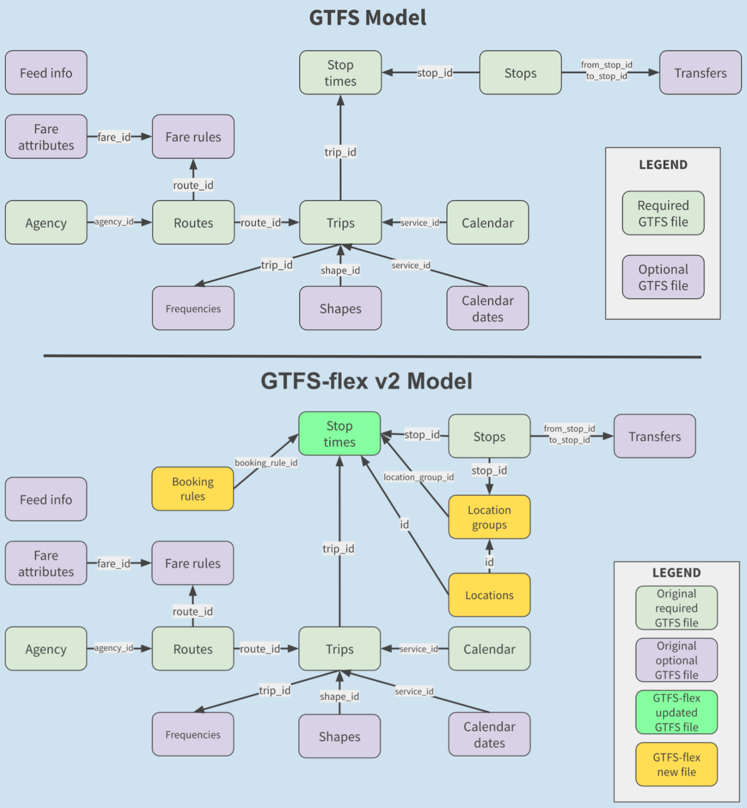

Updated: November 25, 2020. The spec in this repository is now the most up-to-date version of GTFS-Flex. The code in this repo contains the official proposal for GTFS-Flex v2, a GTFS extension that covers all demand-responsive services for the purposes of discovery in trip planning. All features of this specification proposal are currently produced by [Trillium](https://trilliumtransit.com/) and consumed by [OpenTripPlanner version 2](https://www.opentripplanner.org/). DemandTrans and IBI group expect to produce data in this spec by early 2021.

"Version 1" of the GTFS-Flex specification is utilized by OTP 1.4. You can review the Version 1 specification by reviewing versions of this repository from before October 2020. [See the earlier version here.](https://github.com/scmcca/gtfs-flex/blob/master/spec/reference.md)

### About GTFS-Flex

GTFS-Flex is a proposed extension to the [General Transit Feed Specification](http://gtfs.org/). GTFS-Flex adds the capability to model various demand-responsive transportation (DRT) services to GTFS, which currently only models fixed-route public transportation. GTFS-flex is now produced for over 100 transit services, and provides flexible transit trip plans through [OpenTripPlanner](https://www.opentripplanner.org/).

[See the GTFS-Flex proposal here.](spec/reference.md)

### Spec extension schematic diagram

The below shows updated and added files in GTFS-Flex, compared to the current GTFS (original diagram is [here](https://docs.google.com/drawings/d/1g1kuTZPLFphMa942htywksIhxXqM_mMFCROOiEw5eNo/edit?usp=sharing)).

### Example Flex v2 Feeds
[Example 1](spec/Flex_v2_Example_1.zip) [Example 2](spec/Flex_v2_Example_2.zip) [Example 3](spec/Flex_v2_Example_3.zip)
