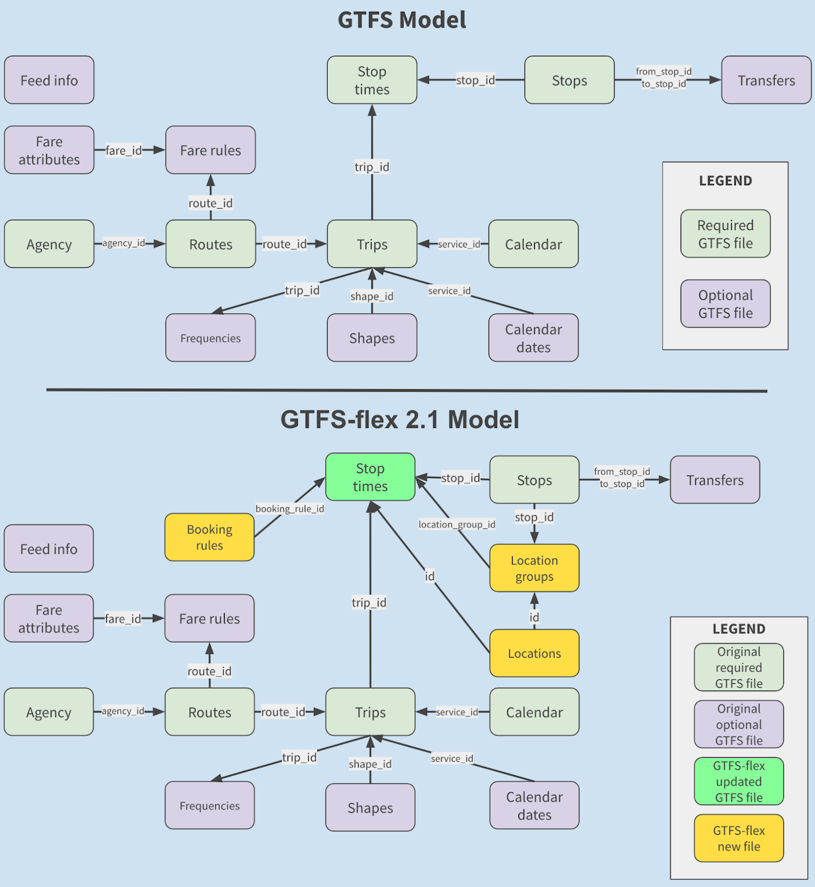

Updated: October 30, 2020. The spec in this repository is now the most up-to-date version of GTFS-flex.  [Here is a Google Doc](https://docs.google.com/document/d/1PyYK6JVzz52XEx3FXqAJmoVefHFqZTHS4Mpn20dTuKE/edit#) where the most recent conversation happened, finalizing this "version 2.1" based on changes to the previous version 2 proposal. The code in this repo is the official proposal for an extension to GTFS that covers all demand-responsive services for the purposes of discovery in trip planning. All features of this specification proposal are currently produced by [Trillium](https://trilliumtransit.com/) and consumed by [OpenTripPlanner version 2](http://docs.opentripplanner.org/en/2.0-rc/)(currently in release candidate).

"Version 1" of the GTFS-flex specification is utilized by OTP 1.4. You can review the Version 1 specification by reviewing versions of this repository from before October 2020.

### About GTFS-flex

GTFS-flex is a proposed extension to the [General Transit Feed Specification](http://gtfs.org/). GTFS-flex adds the capability to model various demand-responsive transportation (DRT) services to GTFS, which currently only models fixed-route public transportation. GTFS-flex is now produced for over 100 transit services, and provides flexible transit trip plans through [OpenTripPlanner](https://www.opentripplanner.org/).

[See the GTFS-flex proposal here.](spec/reference.md)

[More information about GTFS-flex can be found in the N-CATT GTFS-flex white paper.]()

### Spec extension schematic diagram

The below shows updated and added files in GTFS-flex, compared to the current GTFS (original diagram is [here](https://docs.google.com/drawings/d/1g1kuTZPLFphMa942htywksIhxXqM_mMFCROOiEw5eNo/edit?usp=sharing)).

